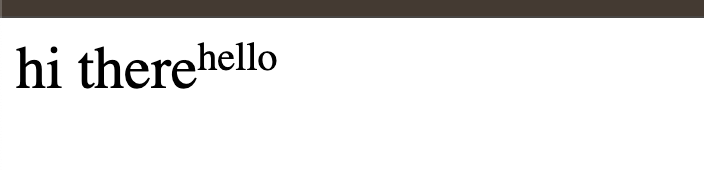
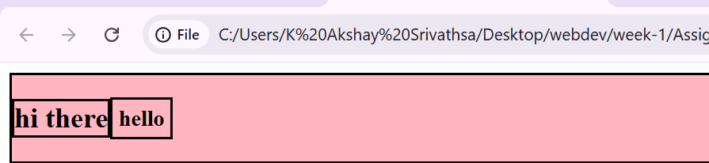
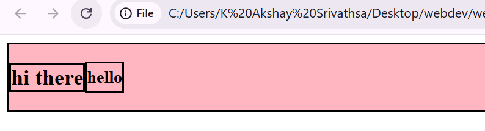
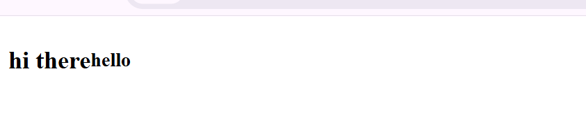

How to center the second hello vertically

Solution -

Approach 1 - adding padding to h3 tag
this adds space inside the hello box, but doesn't center it vertically. Padding pushes content inward, not align it.

Approach 2 - making h3 (child node) as flex
It only has text inside it ("hello"). Making the h3 a flex container doesn't help because there's nothing to align - the text is already there.

Approach 3 - adding align-itmes : center property to parent div

        